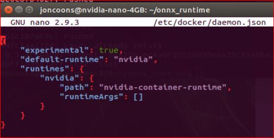

# Nvidia GPU Acceleration of Azure Custom Vision Models for Jetson Devices
One of the challenges in leveraging Azure's Custom Vision containers for production has been GPU acceleration for the exported model when deploying to IoT Edge. The purpose of this repository is to share my learnings from experimenting with Nvidia Jetson-based GPU devices, using IoT Edge with Azure Custom Vision containers.

If you're utilizing Jetpack 4.4, there is a pre-built ONNX runtime container available to implement, which saves a bit of pre-work.  For the purposes of this repository, you would simply replace the base container in the secondary docker file to 'FROM mcr.microsoft.com/azureml/onnxruntime:v.1.4.0-jetpack4.4-l4t-base-r32.4.3' and build the container as noted. 

If, however, you want to utilize Jetpack 4.5.1 or 4.6 (which is the latest as of this publish date) then you would need to follow the ONNX-runtime base container build (dockerfile.jetson) in the folder above, using the appropriate base container from Nvidia, i.e. nvcr.io/nvidia/l4t-base:r32.5.0 for Jetpack 4.5.1.  This is based off of the example container build available in the ONNX Runtime repo:  https://github.com/microsoft/onnxruntime/blob/master/dockerfiles/Dockerfile.jetson

Since hardware acceleration for Nvidia Jetson-based devices is achieved via a passthrough to the underlying CUDA/cuDNN/TensorRT instantiation on the device using the libnvidia-container library (https://github.com/NVIDIA/libnvidia-container/tree/jetson), the base container build for the ONNX runtime should be done on the Nvidia device itself.  To build this, I would recommend the following steps on the Nvidia device. 

1. Run 'sudo apt install nano wget' to install these utilities.
2. Create a directory on your Nvidia device for the files, i.e. 'mkdir onnx_runtime', and cd to that directory.
3. Either open a text editor in the desktop or run 'sudo nano Dockerfile.jetson' in the terminal, and paste the Dockerfile.jetson contents from this repo. 
4. In the desktop, navigate to the Jetson Zoo for ONNX Runtime https://elinux.org/Jetson_Zoo#ONNX_Runtime and download version 1.8.  In the desktop, move the file to the folder created in step one.  From the CLI you can run the 'wget https://nvidia.box.com/s/bfs688apyvor4eo8sf3y1oqtnarwafww -O onnxruntime_gpu-1.8.0-cp36-cp36m-linux_aarch64.whl' found on this page as well.  
5. Now that both the Dockerfile and the .whl file are in the same directory, run 'sudo chmod -R 777 ../<your directory name>' to change the permissions for the folder/files, making them read/write/execute capable.
6. Since the Dockerfile uses experimental features, we also need to change the docker daemon.json file.  Run 'sudo nano /etc/docker/daemon.json' and modify the contents to match:
 
{
    "experimental": true,
    "default-runtime": "nvidia",
    "runtimes": {
        "nvidia": {
            "path": "nvidia-container-runtime",
            "runtimeArgs": []
        }
    }
}
 
 
 
 
7. Run 'sudo systemctl restart docker' to reload the daemon.json settings.
8. Run 'sudo -H DOCKER_BUILDKIT=1 nvidia-docker build -f Dockerfile.jetson -t <your ACR repo>/onnxruntime:0.0.1-arm64v8 . && sudo docker push <your ACR repo>./onnxruntime:0.0.1-arm64v8 to build the container, which will be used as a base container in VS Code for the ONNX model.
9.  Once you've confirmed that the container has pushed to your Azure Container Repo, you can delete the container on the Nvidia device to conserve space.  Run 'sudo docker image ls' to list all your active containers.  Copy the Image ID of the container you want to remove, and run 'sudo docker image rm -f <image id>'
 
 
So why build the ONNX Runtime on the device?  The 'unattended upgrade' does not work on a Windows machine, even using WSL2, I've found.  To get the optimal results, and to ensure that the ONNX runtime 'sees' the target CUDA environment, a local build is best.   
 
Testing raw .jpg images over HTTP with this build running the Tegra OS/Jetpack 4.5.1 using a Flask app has been yielding results in the ~80ms range when tested on a Xavier AGX device, once the ONNX Runtime engine is initiated.  Faster round-trip inference times could likely be achieved through utilizing gRPC endpoints in lieu of HTTP, which is a planned enhancement in the works.

To get started, go to https://azure.microsoft.com/en-us/services/cognitive-services/custom-vision-service/ and train your object detection model using Azure Custom Vision. Export the trained model as an ONNX model (FP16 or FP32), and replace the model.onnx placeholder file in the folder above, as well as the labels.txt file.

I hope that you find this useful for your Azure IoT Edge deployments!
